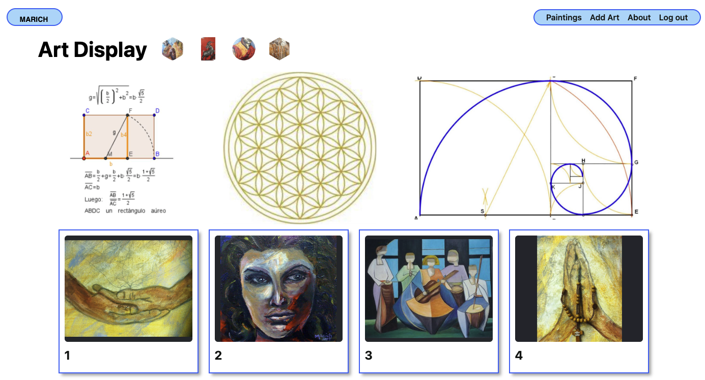

# ART COLLECTOR APP
 
Final project at GA, this website displays art pieces for artist Mary Gonzalez (my mother), and demonstrates the use of Python and Django to create a full-stack application while taking advantage of PostgreSQL and Amazon Web Services databases to allow the artist full CRUD. 
 

  

### Link to view my webiste 
https://marich-art-collector.herokuapp.com 
  

__Technologies used:__
 

 

 

 

 

  

__Credits:__ 

 
  

__Recent changes:__ 
Created App: 11 Aug 2022 
  

__Icebox Items:__ 
Create ability to sort by title, date added 
Add application to add other items of interest 
